# KADAS Albireo

KADAS Albireo is a specialized Geographic Information System based on [QGIS](http://qgis.org/).

## Special features:

 * Streamlined user interface
 * Redlining functionality
 * GPS route digitizing
 * Advanced terrain Analysis functionality
 * Numeric inputs for redlining and terrain analysis
 * Place search with Swisstopo API and Sphinx search API drivers 
 * Catalog with Swisstopo API, ArcGIS Server and ArcGIS Portal drivers
 * Providers for ArcGIS Feature and Map services
 * 3D globe with marker symbols as billboards
 * Multiple map windows
 * Improved WMTS support
 * MGRS support for coordinate display and grids in print layouts
 * Online-/Offline detection with online-/offline project templates

Some functionality is implemented as Python plugins:

 * Print dialog with quick settings and preview
 * Integrated user manual

An additional start parameter is used to activate the ribbon GUI. See `kadas-albireo.bat` in the bin directory.

## Screenshots

### Multiple views
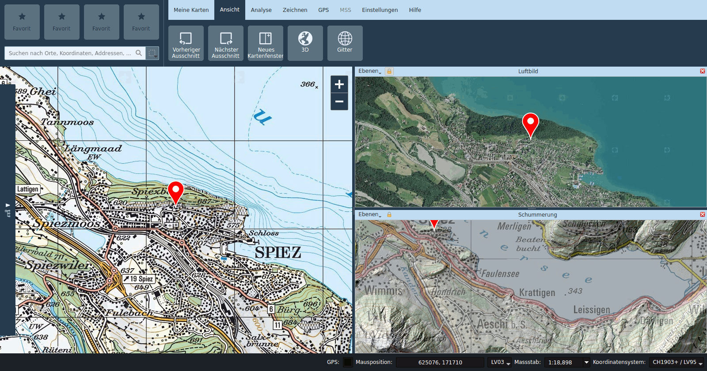

### Mesurement tools

Lines, circles, angles, areas:

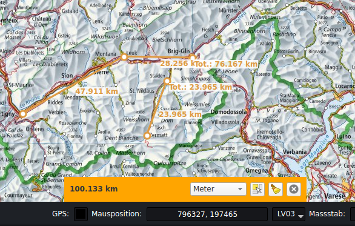

Geodectic distance measurment:

Geodectic radius with real-time display:

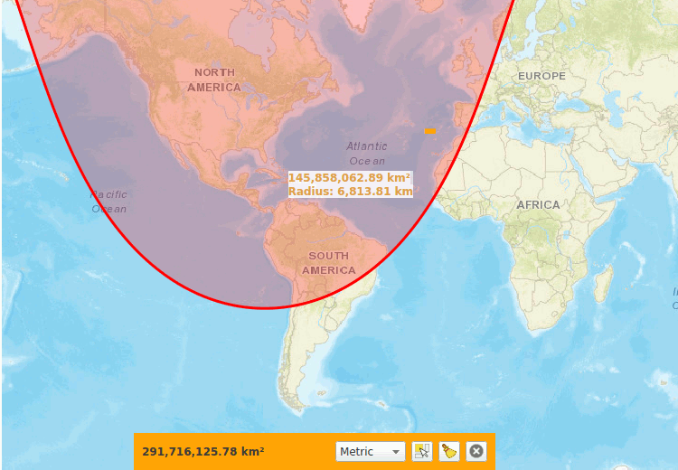

### Terrain analysis

Line of Sight calculations:

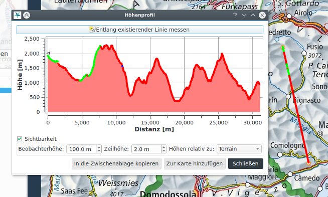

Slopes:

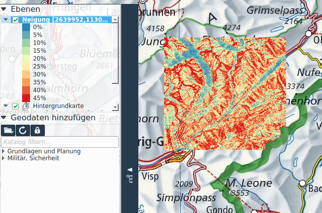

More tools like hillshade and viewshed analysis are available as well.

### Search

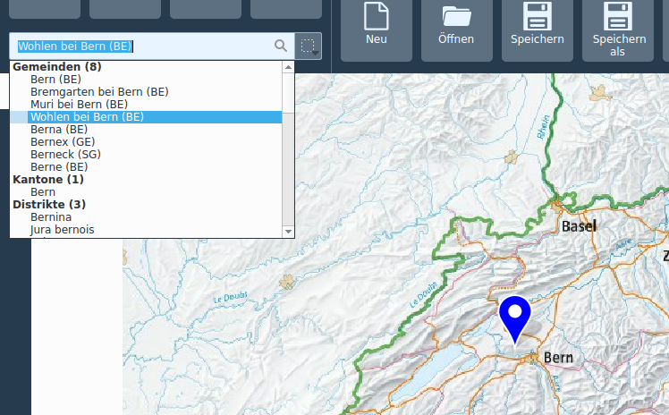

### Redlining tools

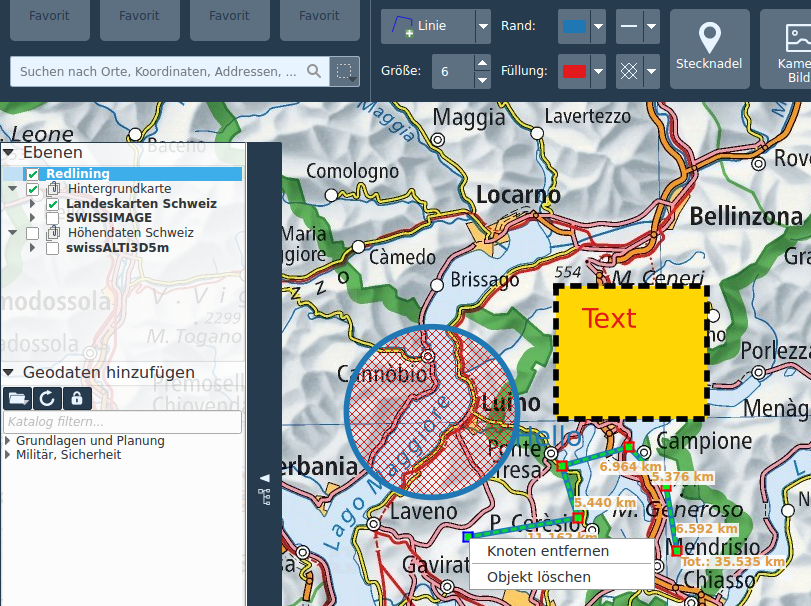

### Import camera images (EXIF)

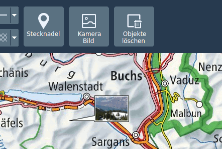

### GPS tools (GPX)

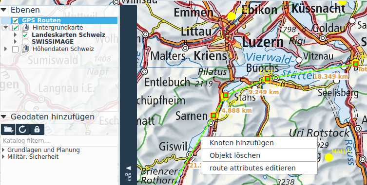

### Military symbols

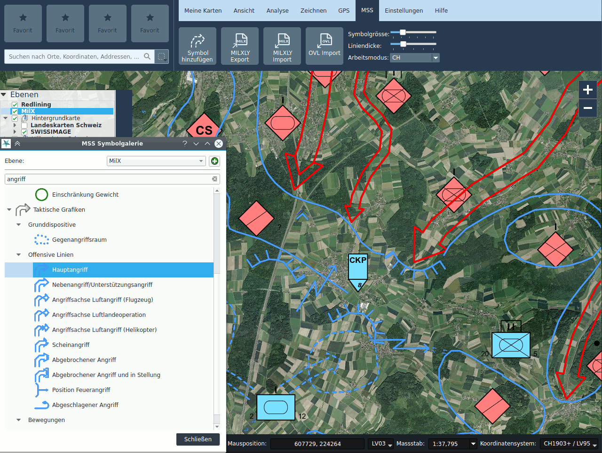

### 3D visualization and interaction

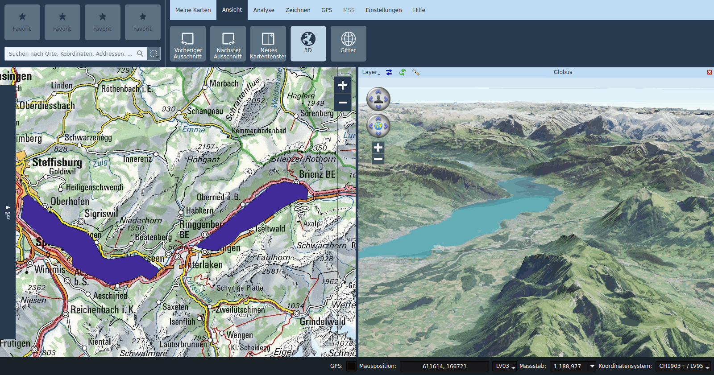
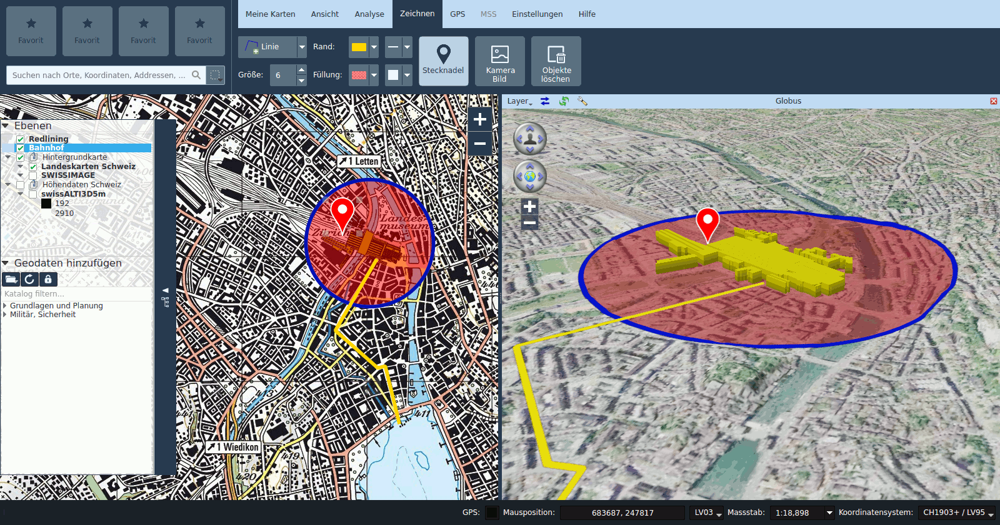

### Printing

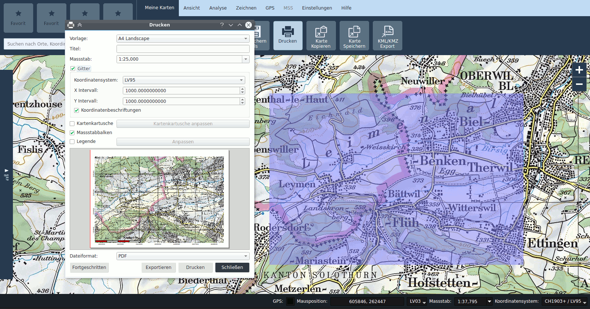

## Feedback and support:

This software is commercially supported by Sourcepole, Switzerland. 
To get more information, please contact qgis at sourcepole.com.
